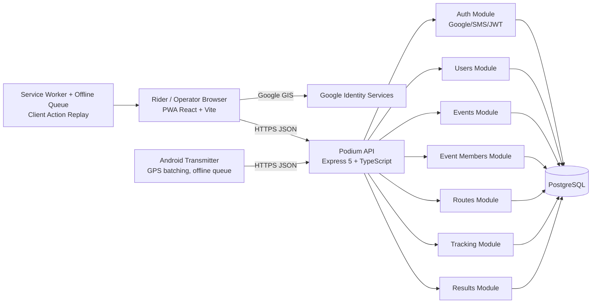
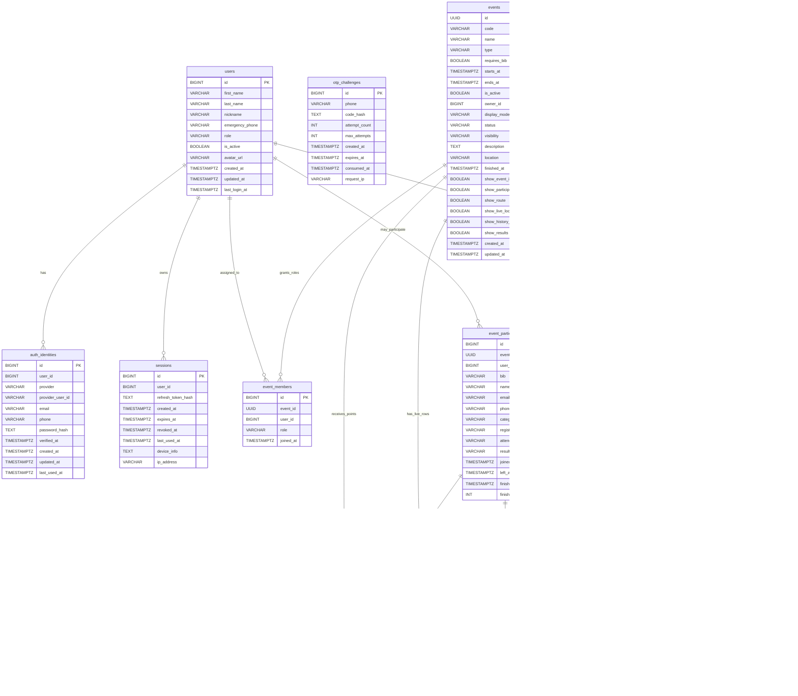
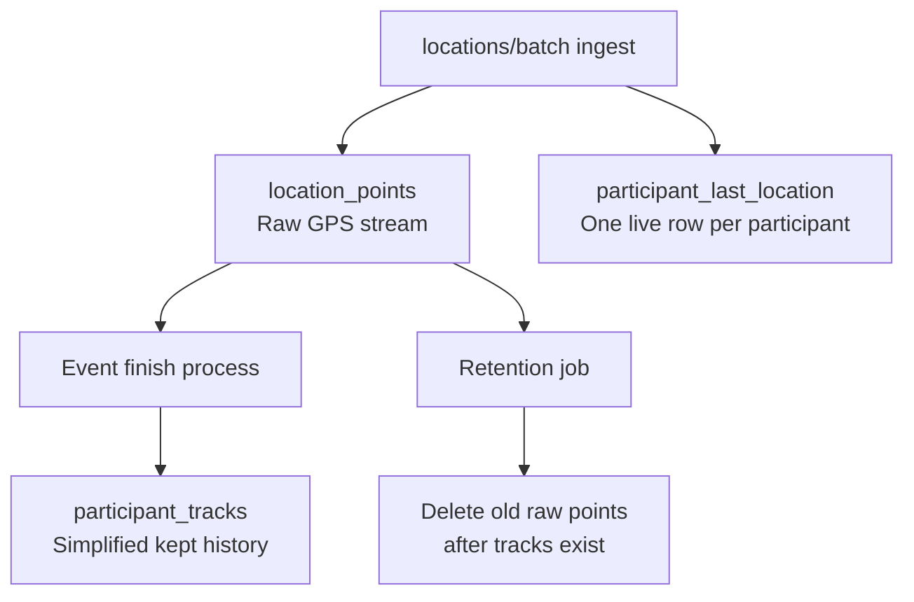

# ElNino System Schematic and DB Entity Map

**Date:** 2026-08-22  
**Based on:** architecture, schema, and API contract documents in `plan/`

## 1) Full System Schematic



## 2) Runtime Interaction Flow

```mermaid
sequenceDiagram
    participant PWA as PWA Client
    participant GIS as Google Identity Services
    participant API as Express API
    participant DB as PostgreSQL
    participant AND as Android App

    PWA->>GIS: Initialize Google sign-in (client_id)
    GIS-->>PWA: idToken
    PWA->>API: POST /api/v1/auth/google
    API->>DB: upsert user/auth identity/session
    DB-->>API: user + session rows
    API-->>PWA: accessToken + refreshToken

    AND->>API: POST /api/v1/events/join
    API->>DB: upsert event_participants
    DB-->>API: participantId
    API-->>AND: participantId

    AND->>API: POST /api/v1/events/:eventId/locations/batch
    API->>DB: insert location_points + upsert participant_last_location
    DB-->>API: saved count
    API-->>AND: { saved }

    PWA->>API: GET /api/v1/events/:eventId/live
    API->>DB: read participant_last_location
    DB-->>API: latest rider positions
    API-->>PWA: live map payload
```

## 3) Module Boundaries (Backend)

| Module | Main Responsibility | Primary Tables |
|---|---|---|
| auth | Google/SMS login, refresh rotation, logout/logout-all | `auth_identities`, `sessions`, `otp_challenges`, `users` |
| users | Profile update/read | `users` |
| events | event lifecycle, join by code, basic event retrieval | `events`, `event_participants` |
| members | per-event permission roles | `event_members` |
| tracking | ingest GPS, serve live positions, keep history track | `location_points`, `participant_last_location`, `participant_tracks` |
| routes | upload/draw/publish/reuse route library | `routes`, `event_routes` |
| results | finish state and standings | `event_participants`, `participant_tracks` |
| offline dedup | prevent duplicate replay effects | `client_actions` |

## 4) Complete DB Entity Diagram



## 5) Tracking Data Lifecycle



## 6) Entity Roles Clarification

| Concept | Table | Meaning |
|---|---|---|
| Who can operate an event | `event_members` | owner/operator/viewer permissions |
| Who is riding/in start list | `event_participants` | registration + attendance + result statuses |
| Who created event | `events.owner_id` | event owner identity |

## 7) Status Enums (Operational View)

### Event
- `type`: `RIDE`, `RACE`
- `display_mode`: `standard`, `competition`
- `status`: `draft`, `published`, `registration_open`, `ready`, `live`, `finished`, `cancelled`
- `visibility`: `public`, `private`

### Membership and Participation
- `event_members.role`: `owner`, `operator`, `viewer`
- `event_participants.registration_status`: `registered`, `waiting_approval`, `approved`, `rejected`
- `event_participants.attendance_status`: `unknown`, `present`, `dns`, `started`
- `event_participants.result_status`: `none`, `finished`, `dnf`, `stopped`, `unknown`

## 8) Non-Functional Architecture Rules

1. UTC everywhere in storage and API timestamps.
2. Android existing endpoint fields are frozen.
3. No ORM; SQL through `pg`.
4. No DB foreign keys in v1; relationships enforced in application logic.
5. `location_points` is the only high-volume purge table; tracks/events/results are retained.

## 9) Quick Ownership Map

| Layer | Primary Owner |
|---|---|
| OAuth client origin allowlist | Google Cloud credentials admin |
| API behavior and auth/session logic | Backend team |
| DB schema migration execution | Backend/DB team |
| PWA rendering and client env | Frontend team |

---

This document is the complete schematic baseline for system design reviews, onboarding, and implementation planning.
